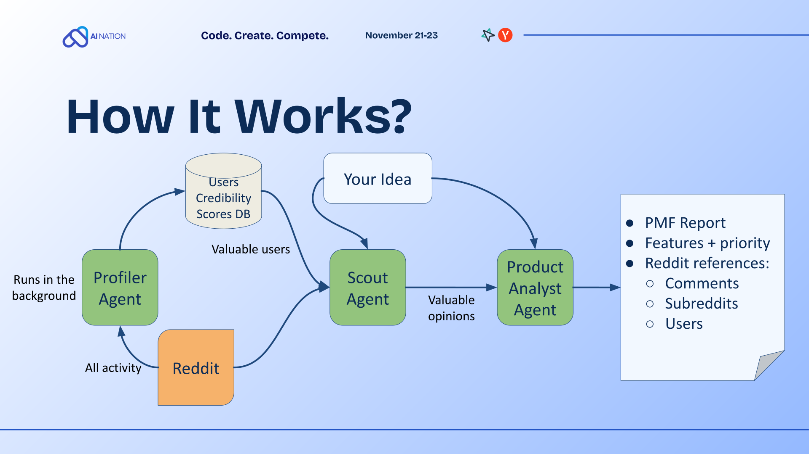

# CrowdProof

> **AI-Powered Product Validation Engine**
> *Automating the path from Idea to Product-Market Fit using Multi-Agent Systems.*

## Demo

https://github.com/user-attachments/assets/cc3a1f65-60b8-4810-b66b-a3dcb6149248

> [!NOTE]
> **Disclaimer**: The frontend code is not currently included in this repository; this video serves only to demonstrate the visual process of the agent's work.

## Overview

CrowdProof is an autonomous agentic system designed to validate product ideas by analyzing unstructured community data. Unlike traditional market research which is slow and biased, CrowdProof utilizes a swarm of specialized AI agents to mine, filter, and synthesize millions of data points from platforms like Reddit in real-time.

This repository contains the core logic for the **Scout**, **Profiler**, and **Product Analyst** agents, along with the orchestration layer that manages the data ETL pipeline.

## Architecture & ETL Pipeline

The system follows a linear ETL (Extract, Transform, Load) process orchestrated by a central state machine. The pipeline is divided into two main phases, handled by distinct agents:

### Phase 1: The Scout Agent (Data Ingestion & Filtering)
The Scout Agent is responsible for noise reduction and high-quality signal extraction.

1.  **Subreddit Identification**: Scans thousands of communities to find high-affinity discussion clusters.
2.  **User Qualification**: Filters authors based on credibility markers to exclude bots and low-quality contributors.
3.  **Opinion Mining**: Extracts unstructured text (comments/posts) and normalizes them for downstream analysis.

### The Profiler Agent (Background Enrichment)
Operates in the background to analyze long-term user activity. It enriches user profiles with behavioral tags (e.g., "Tech Savvy", "Early Adopter") to provide deeper context for the Analyst Agent.

### Phase 2: The Product Analyst Agent (Synthesis & Insight)
The Product Analyst Agent transforms raw opinions into structured product artifacts.

1.  **Feature Extraction**: Uses LLMs to cluster user pains and desires into distinct feature candidates.
2.  **Backlog Prioritization**: Ranks features based on a weighted consensus model.
3.  **PMF Validation**: Aggregates all signals to calculate a confidence score for Product-Market Fit.

---

## Methodology & Scoring Formulas

To ensure objective analysis, CrowdProof employs a set of proprietary scoring algorithms. These metrics drive the ranking systems seen in the dashboard.

### 1. Subreddit Relevance Index ($R_s$)

We rank communities not just by size, but by semantic alignment with the product concept.

$$ R_s = w_1 \cdot \text{Sim}(V_{idea}, V_{sub}) + w_2 \cdot \log(A_{active}) + w_3 \cdot E_{rate} $$

Where:
*   $\text{Sim}(V_{idea}, V_{sub})$: Cosine similarity between the product idea vector and the subreddit's topic centroid.
*   $A_{active}$: Daily Active Users (DAU) to ensure liquidity of discussion.
*   $E_{rate}$: Engagement rate (comments per post) indicating community vibrancy.
*   $w_{1,2,3}$: Adaptive weights (currently set to favor semantic similarity).

**Target Threshold**: Communities with $R_s \ge 9.0$ are in the "Green Zone". Communities with $R_s \ge 8.0$ are considered "Orange Zone" (Exploratory Options).

### 2. User Credibility Score ($C_u$)

We value expert opinions over general noise. Every user is assigned a credibility score before their data is processed.

$$ C_u = \left( \frac{K_{domain}}{K_{total} + \epsilon} \right) \cdot (1 - e^{-\lambda \cdot T_{age}}) + \sum_{i} \text{Badge}_i $$

Where:
*   $K_{domain}$: Karma points earned in relevant subreddits (domain expertise).
*   $T_{age}$: Account age in years (sybil resistance).
*   $\text{Badge}_i$: Weights assigned to specific flairs or awards (e.g., "Verified Buyer", "Industry Pro").

*Users are also tagged with attributes like `High Spending Power` or `Tech Savvy` based on NLP analysis of their post history.*

### 3. Consensus Weight ($W_{consensus}$)

Used to prioritize the feature backlog. A feature is important if credible users agree on it with high intensity.

$$ W_{consensus} = \sum_{j=1}^{N} \left( C_{u_j} \cdot S_{j} \cdot I_{j} \right) $$

Where:
*   $N$: Number of unique comments linking to this feature.
*   $C_{u_j}$: Credibility score of the user $j$.
*   $S_{j}$: Sentiment score of the comment (normalized -1 to 1).
*   $I_{j}$: Relevance intensity (how strongly the comment implies the need for this feature).

### 4. PMF Confidence Score

The final "Product-Market Fit" validation score (0-100) displayed in the report.

$$ \text{PMF} = \frac{1}{1 + e^{-(\alpha \cdot \bar{W}_{top5} + \beta \cdot \text{Vol}_{total} - \delta)}} \times 100 $$

This sigmoid function aggregates the consensus weights of the top 5 requested features ($\bar{W}_{top5}$) and the total volume of relevant discussions ($\text{Vol}_{total}$), providing a probabilistic confidence interval for market demand.

---

## Tech Stack

*   **Core Logic**: Python 3.14, LangGraph
*   **Data Processing**: ClickHouse, jq, Yandex Cloud Storage, Python
*   **LLM Integration**: OpenAI GPT-4o (for semantic extraction)
*   **Vector Database**: ChromaDB (for semantic search)
